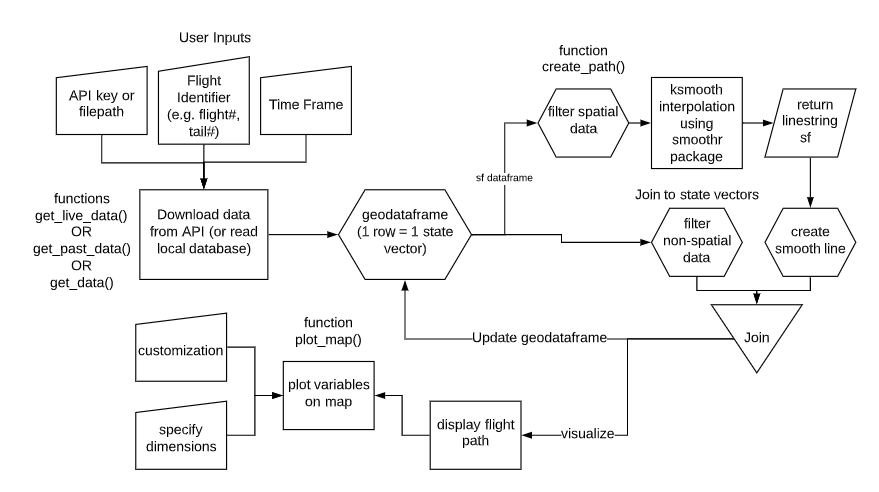
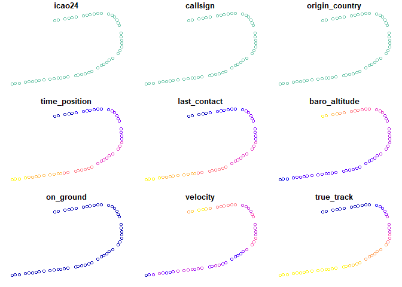
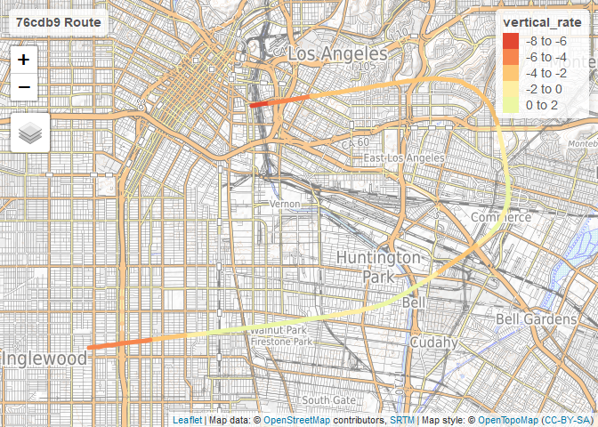
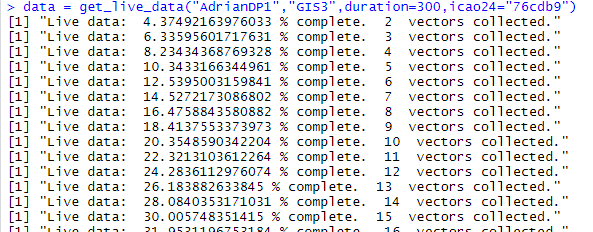

README
================
Jalen Jiang, Adrian Przezdziecki
6/14/2020

## Follow Along

Click here for a demo to follow along with this tutorial:  
[link](https://rstudio.cloud/project/1384039)

## Background

This package pulls live and/or historic data from the Opensky API and
allows you to convert and visualize the flight paths of the aircraft as
linestring data.

## Data Flow



The provided data collection functions require opensky user
authentication as inputs as well as parameters which specify the
aircraft to track and time frame. The collected data can be inputted
into `create_path` which turns the point data into a smoothed chain of
line segments, which can inhance the visualization of the flight path.

## Setup

To start, you need to create a free account at
[link](opensky-network.org) and verify your email. Next, you will need
to install the package `openskyr` created by Luis Gasco. `openskyr`
provides basic tools for pulling from the API. `flightpath` uses
`openskyr`’s function `get_state_vectors()` for the data collection in
`get_live_data()`.

``` r
devtools::install_github("luisgasco/openskyr")
```

    ## Skipping install of 'openskyr' from a github remote, the SHA1 (35e64cba) has not changed since last install.
    ##   Use `force = TRUE` to force installation

``` r
library(openskyr)
library(flightpath)
library(sf)
```

    ## Linking to GEOS 3.8.0, GDAL 3.0.4, PROJ 6.3.1

## Plotting smooth lines with flight data

We have provided a sample data set, which was created with the
get\_data() function. Later you will learn how to get data yourself.  
This dataframe depicts Singapore Airlines flight 38 on the final
approach into LAX. It was served by a plane with `icao24` code 76cdb9.

``` r
plot(sia38)
```

    ## Warning: plotting the first 9 out of 14 attributes; use max.plot = 14 to plot
    ## all

<!-- -->

We have plotted the dataframe, which is a simple features collection of
points. Each row represents a state vector, or an observation made of
the plane at a certain time. Attributes include speed, altitude,
vertical rate, and other information. Each observation is approximately
5 seconds apart from each other, which is the maximum resolution that
can be obtained with a free user account.  
But everyone knows that planes do not jump from point to point in real
life\! During those in-between 5 seconds, it varies in location and in
its speed and other physical properties.  
We can create an interpolation of these using `create_path()` which up
to doubles this resolution and converts the simple features into a chain
of smoothed linestring segments. Non-spatial data is preserved and
interpolated as well.

``` r
path = create_path(sia38)
```

By default, the smoothing algorithm is performed. To turn this off,
supply `smooth = FALSE` as an argument. You would probably do this if
your flight path is already mostly straight and a curve interpolation is
not necessary. In the case of our sample data set, the plane is making a
dramatic turn en route to LAX, and simply connecting straight lines
between the points would produce a jagged line, so we leave the
smoothing on.  
Other options include `method` which can set the smoothing algorithm.
Choices include `ksmooth` (default), `spline`, `chaikin`, and `densify`.
See `smoothr` documentation for more details. If you are using the
`ksmooth` method, another possible optional argument is `smoothness`
which is an integer that determines the degree of smoothness you want.
`create_path` outputs a `sf` dataframe which more than doubles the
resolution of the original point data. The feature geometries are
linestrings which connect together to form the entire flightpath in the
dataframe.

## Plotting data

Because `path` is a `sf` data set, you are now free to visualize it
however you want. If you want a built-in function that is optimized for
the linestring chain we have produced, you can use:

``` r
plot_map(path,
         variable = 'vertical_rate')
```

    ## tmap mode set to interactive viewing

    ## Variable(s) "vertical_rate" contains positive and negative values, so midpoint is set to 0. Set midpoint = NA to show the full spectrum of the color palette.

<!-- --> Specify the
variable of interest in the `variable` argument. The function will
search for this variable in the columns of `path` and visualize it. If
you would prefer a static plot instead, simply supply the optional
argument `view = FALSE`.

## Getting data

Now that you have learned how to create and plot flightpaths, you can
start collecting your own data and track your favorite planes. There are
three ways to do this:

### Get live data

To get the state vectors of every plane in the opensky network, provide
your credentials and specify the collection time in seconds. You will
have to sit and wait for it to finish.

``` r
get_live_data(username = "your_user",
              password = "your_pass",
              duration = 10)
```

It is recommended that you specify a specific aircraft to track, if you
want to create visualizations later and reduce the cost of your data
collection.  
Head over to [link](opensky-network.org/network/explorer) and take a
look around. For best results, you should pick an airplane (but
helicopters are possible), and preferably one that has just recently
taken off, so you can see the twists and turns it will make. Click on
the aircraft you would like to track, and copy its `Mode S Code (hex)`.
This hexadecimal code is also known as `icao24` identifier, and it is
the unique identifier for aircraft in the world. For our purposes, input
this as a string.

``` r
get_live_data(username = "your_user",
              password = "your_pass",
              duration = 100,
              icao24 = "000000")
```

If all goes well, your output should look like this to help keep you
patient while waiting:



### Get Past Data

With a user account, you can also pull historic data up to 1 hour in the
past. `icao24` is required for this function.

``` r
get_past_data(username = "your_user",
              password = "your_pass",
              start_seconds_ago = 100,
              icao24 = "000000")
```

### Get Data

What if you have found an aircraft that you would like to track live,
but also would like to know where it has just been? `get_data` combines
`get_past_data` and `get_live_data` for seamless transition from
historical collection to live collection. Note that `start_seconds_ago`
and `duration` are both optional, this is a general function for either
or both purposes. `icao24` is required.

``` r
get_data(username = "your_user",
         password = "your_pass",
         start_seconds_ago = 100,
         duration = 100,
         icao24 = "000000")
```

## Roadmap for the future

There is much more left to be accomplished\! We can:  
\* allow customizable resolution of interpolation in `create_path`.
Right now it is limited to 2x.  
\* allow most customizable plotting through `plot_map`  
\* provide support for 3D mapping, which would involve using smoothing
for the altitude z-axis as well.  
\* allow user to suspend live data collection in case of poor internet
connection, aircraft leaving range, or aircraft landing.  
\* use threading to collect live data for multiple aircrafts at once,
once we gain more expertise in R.  
\* support visualizing and processing of multiple flightpaths at once.  
\* open to any feedback and suggestions from the Opensky community
and/or CRAN.

## About Us

Jalen Jiang is a third year undergraduate Geographic Studies major and
Public Policy major at the University of Chicago.  
Adrian Przezdziecki is a third year undergraduate Public Policy major
and Computer Science minor at the University of Chicago.  
Thank you for trying out our package.
